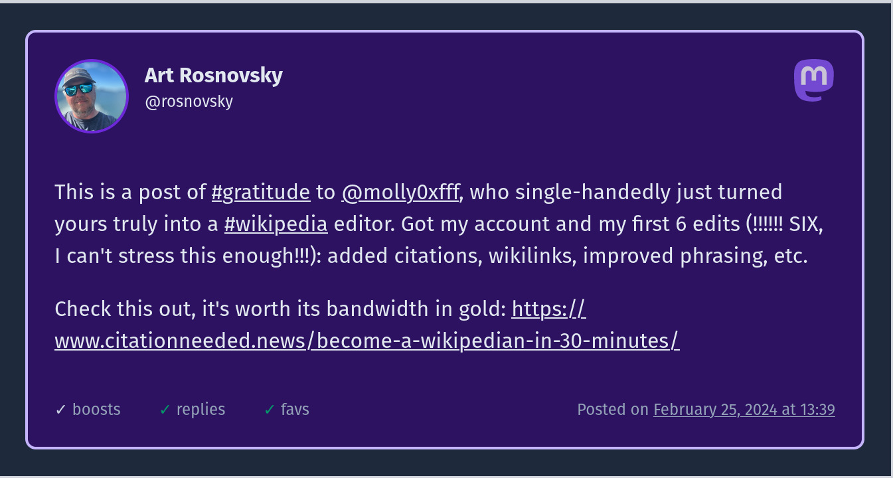
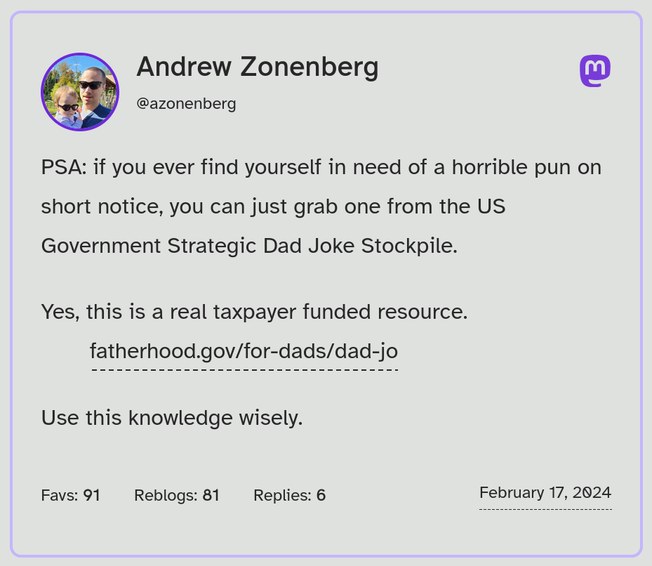

# Astro Mastodon

> Work in Progress

Easily embed Mastodon posts (and eventually other ActivityPub posts) into your Astro blog posts.





## How to use

Install the package:

```shell
pnpx astro add astro-mastodon
```

Update your `astro.config.mjs` file:

```js
// Other imports
import astroMastodon, { remarkMastodonEmbed } from "astro-mastodon";

export default defineConfig({
  // ...
  markdown: {
    remarkPlugins: [remarkMastodonEmbed],
  },
  // ...
});
```

Add `import "astro-mastodon/dist/output.css"` at the top of your post template file (e.g. `src/pages/blog/[slug]/index.astro`)

In your markdown file, add post "mention":

```markdown
---
title: Embeds FTW!
---

This is an example of an embedded Mastodon post:

`@rosnovsky@lounge.town:109860863149734322`
```

The anatomy of the embed is as follows:

`@username@instance.domain:postId`

## Features

- [x] Embed Mastodon posts in any Astro component
- [x] Embed Mastodon posts in `mdx` [content](https://docs.astro.build/en/guides/content-collections/) files
- [x] Embeds are generated at build time (no client-side JavaScript)
- [x] Install Astro Mastodon as [Astro Integration](https://astro.build/integrations/) with `astro add`
- [ ] Embed profiles, polls, posts with media attachments
- [x] Embed all of the above in [plain `markdown` content](https://docs.astro.build/en/guides/markdown-content/)
- [ ] Embed other ActivityPub post types (PeerTube videos, BookWyrm books, Pixelfed photos, etc)
