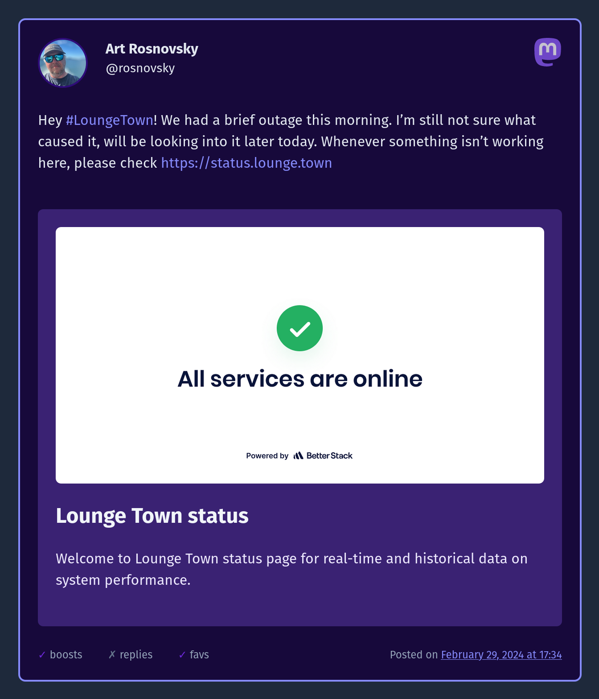
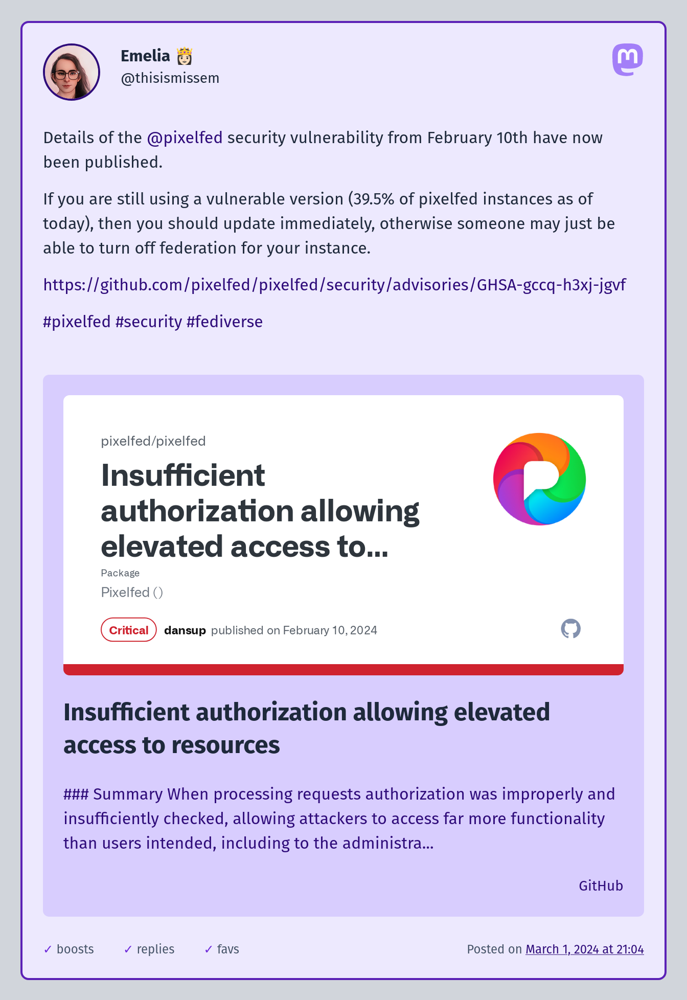

# Astro Mastodon

Easily embed Mastodon posts into your Astro blog posts.



## Features

- Works with `.md`, `.mdx` and `.astro` files
- Embed posts from Mastodon (other ActivityPub embeds are coming!)
- Embed posts with plain text, images, link cards, videos, embedded YouTube players, gifs, and more!
- No client-side JavaScript, cards are generated at build time

## How to use

Install the package:

```shell
pnpm add astro-mastodon
```

Update your `astro.config.mjs` file:

```js
// Other imports
import { remarkMastodonEmbed } from "astro-mastodon";

export default defineConfig({
  // ...
  markdown: {
    remarkPlugins: [
      remarkMastodonEmbed,
      // other plugins
    ],
  },
  // ...
});
```

Add `import "astro-mastodon/dist/output.css"` at the top of your post template file (e.g. `src/pages/blog/[slug]/index.astro`)

In your markdown file, add post "mention":

```markdown
---
title: Embeds FTW!
---

This is an example of an embedded Mastodon post:

`@rosnovsky@lounge.town:109860863149734322`
```

The anatomy of the embed is as follows:

`@username@instance.domain:postId`

## Development

Clone the repo and run

```sh
pnpm i
pnpm dev
```

Open `http://localhost:4321` and have fun!

## Screenshots



